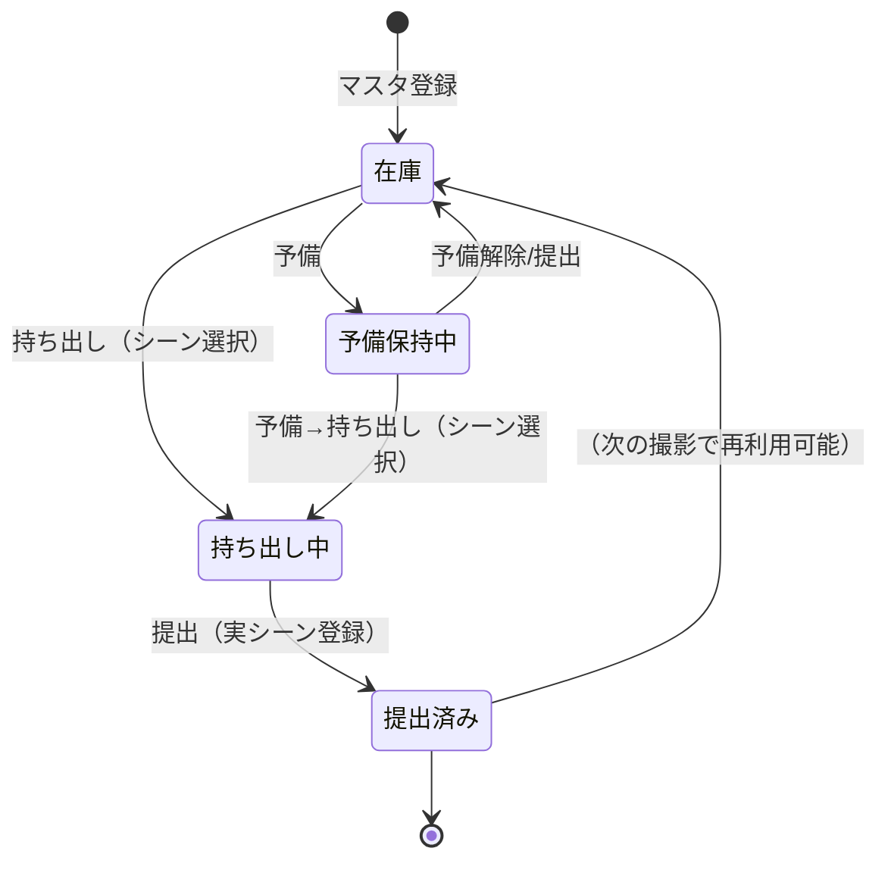
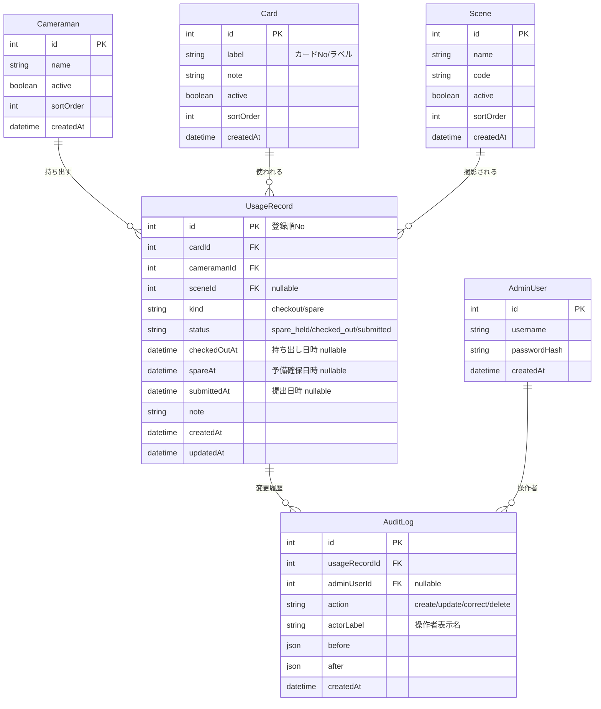
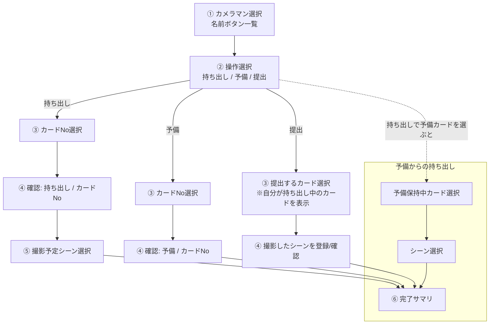
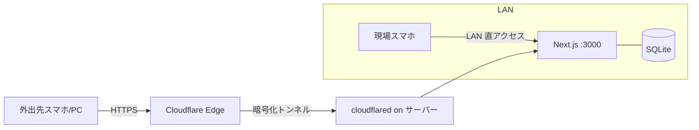

# 記録班 SDカード管理システム ─ システム設計書

| 項目 | 内容 |
| --- | --- |
| ドキュメント種別 | システム設計書（基本設計） |
| バージョン | 1.0 |
| 最終更新 | 2026-06-21 |
| 対象システム | 記録班 SDカード管理システム（Web アプリ） |

---

## 1. 目的・背景

映像制作チーム（記録班）では、撮影に使う **SD カードの取り回し**（誰が・どのカードを・いつ持ち出し、どのシーンを撮り、いつ提出したか）が
管理されていないと、**カードの紛失・取り違え・データ消失**といったトラブル時に追跡ができません。

本システムは以下を実現します。

1. SD カードの **持ち出し / 予備 / 提出** の操作を、現場のスマホから数タップで記録する。
2. 記録を中央サーバーに集約し、管理者が **ダッシュボード** で一覧・検索・修正できる。
3. トラブル発生時に **「いつ・誰が・どのカードで・どのシーンを」** を即座に追跡できる。

### 1.1 用語定義

| 用語 | 説明 |
| --- | --- |
| カメラマン | カードを持ち出す撮影担当者。事前にマスタ登録される。 |
| カード（カードNo） | 物理的な SD カード。識別用の No/ラベルを持つ。事前にマスタ登録される。 |
| シーン | 撮影対象のシーン。事前にマスタ登録される。 |
| 持ち出し | カメラマンが特定シーンを撮るためにカードを持ち出す操作。 |
| 予備 | カメラマンがバックアップ用にカードを確保する操作（撮影シーン未定）。 |
| 提出 | 撮影後にカードを返却する操作。実際に撮ったシーンを登録する。 |
| 利用記録 | 1 枚のカードの「持ち出し〜提出」を 1 行で表す管理上の単位。 |

---

## 2. 想定利用者と権限（ロール）

| ロール | 利用端末 | 認証 | できること |
| --- | --- | --- | --- |
| **管理者 (Admin)** | PC（兼スマホ） | ID + パスワード | マスタ登録（カメラマン/カード/シーン）、全記録の閲覧・検索・修正、ダッシュボード閲覧 |
| **利用者（カメラマン）** | スマホ | 名前ボタン選択（＋任意で PIN/共通パス） | 持ち出し / 予備 / 提出 の登録操作のみ |

> 利用者ログインは「現場での速さ」を最優先し、一覧ボタンから名前を選ぶだけの軽量方式とする。
> ただしインターネット公開時はアプリ全体を 1 段階保護する（[§9 セキュリティ](#9-セキュリティ設計)参照）。

---

## 3. 機能要件一覧

要件と本設計での対応を対応表で示します。

| # | 要件（依頼内容） | 対応する設計 |
| --- | --- | --- |
| F-1 | ブラウザから操作できる Web アプリ | Next.js による Web アプリ（[§5](#5-システムアーキテクチャ)） |
| F-2 | 情報を管理・統括するサーバー | Next.js サーバー + SQLite（[§5](#5-システムアーキテクチャ)） |
| F-3 | 管理者権限とダッシュボード | Admin ロール + 管理画面（[§7.2](#72-管理者画面pc-基本)） |
| F-4 | カメラマン/カードNo/シーンを事前にマスタ登録 | マスタ管理画面 + 3 マスタテーブル（[§6](#6-データモデル設計)） |
| F-5 | 名前ボタン選択でログイン | 利用者ログイン画面（[§7.1](#71-登録画面スマホ-基本)） |
| F-6 | 持ち出し/予備/提出の選択 | 操作種別選択画面（[§7.1](#71-登録画面スマホ-基本)） |
| F-7 | カードNo選択＋種別確認 | カード選択 → 確認画面 |
| F-8 | 持ち出し時は撮影予定シーンを選択 | シーン選択画面 |
| F-9 | 提出時に撮影したシーンを登録 | 提出フロー（実シーン登録） |
| F-10 | 予備→持ち出し時にシーンを選択 | 予備転用フロー |
| F-11 | 登録順 No・持出/提出日時・カメラマン・カードID・シーンの一覧 | 利用記録テーブル（[§6.3](#63-テーブル定義)） |
| F-12 | 誤操作の修正機能 | 記録編集 + 監査ログ（[§7.2](#72-管理者画面pc-基本)） |
| F-13 | フィルター・検索（日時範囲、カメラマン/カード/シーン複数選択） | 検索 API + 一覧フィルタ（[§8.3](#83-検索フィルタ仕様)） |
| F-14 | スマホ/PC レスポンシブ対応 | Tailwind モバイルファースト（[§7.3](#73-レスポンシブ方針)） |
| F-15 | LAN 基本 + インターネット操作（無料） | 自前ホスト + Cloudflare Tunnel（[§10](#10-公開ネットワーク構成)） |

### 3.1 非機能要件

| 区分 | 要件 |
| --- | --- |
| コスト | 月額無料の範囲で運用できること |
| 可用性 | 撮影日中に稼働していればよい（24/365 不要）。常時起動の LAN 内 PC / Raspberry Pi を想定 |
| 性能 | 同時利用は数人〜十数人程度。レスポンスは体感 1 秒以内 |
| データ保全 | DB ファイルの定期バックアップ（自動コピー） |
| 監査性 | 全ての作成/更新/修正操作を監査ログに残す |
| 操作性 | 現場では 3〜5 タップで 1 操作が完了すること |

---

## 4. 状態モデル（カードのライフサイクル）

カードは以下の状態を遷移します。利用記録（後述）の `status` がこれを表現します。



- **在庫**: 誰にも持ち出されていない状態。
- **予備保持中**: カメラマンが予備として確保。撮影シーンは未確定。
- **持ち出し中**: 特定シーン撮影のために持ち出し中。提出待ち。
- **提出済み**: 撮影後に返却済み。実際に撮ったシーンが確定。

---

## 5. システムアーキテクチャ

### 5.1 構成方針

- **単一フルスタックアプリ（Next.js）** とし、フロントエンド（React）とバックエンド（API Routes）を 1 つのコードベース・1 プロセスで提供する。
  → 自前ホストが容易（`next start` 1 つ）、デプロイ対象が 1 つで無料運用しやすい。
- データは **SQLite（ファイル DB）** に保存。ORM は **Prisma**。
  → サーバー 1 台で完結。バックアップは DB ファイルをコピーするだけ。将来 PostgreSQL（Supabase/Neon 無料枠）へ移行も容易。

### 5.2 アーキテクチャ図

```mermaid
flowchart TB
    subgraph 利用者端末
      M[スマホ ブラウザ<br/>登録画面]
      P[PC ブラウザ<br/>管理画面]
    end

    subgraph サーバー["常時起動マシン (LAN内 PC / Raspberry Pi)"]
      direction TB
      N[Next.js アプリ<br/>React UI + REST API]
      DB[(SQLite DB<br/>Prisma)]
      N <--> DB
    end

    CF[Cloudflare Tunnel<br/>無料・HTTPS]

    M -- LAN: http://192.168.x.x:3000 --> N
    P -- LAN --> N
    M -. Internet: https://xxx.example.com .-> CF
    P -. Internet .-> CF
    CF --> N
```

### 5.3 技術スタック

| レイヤ | 技術 | 代替案 |
| --- | --- | --- |
| 言語 | TypeScript | — |
| フレームワーク | Next.js (App Router) | Vite + React（フロント）＋ Fastify（API）の分離構成 |
| UI/スタイル | Tailwind CSS + shadcn/ui | MUI、Chakra UI |
| データ取得 | TanStack Query (React Query) | SWR |
| DB | SQLite | PostgreSQL（クラウド移行時）|
| ORM/マイグレーション | Prisma | Drizzle ORM |
| 認証 | Auth.js (NextAuth) / 自前セッション (httpOnly Cookie) | — |
| バリデーション | Zod | — |
| 公開 | Cloudflare Tunnel | ngrok、Tailscale Funnel、Render 無料枠 |

---

## 6. データモデル設計

### 6.1 ER 図



### 6.2 設計のポイント — なぜ「利用記録（UsageRecord）」1 行モデルか

管理画面の一覧は「**No / 持ち出し日時 / 提出日時 / カメラマン / カードID / シーン名**」を **1 行**で見せる要件です（F-11）。
これを素直に表現するため、**1 枚のカードの「持ち出し〜提出」を 1 レコード**として持ちます。

操作と DB 反映の対応：

| 操作 | DB 反映 |
| --- | --- |
| 持ち出し | `UsageRecord` を新規作成。`kind=checkout`, `checkedOutAt=now`, `sceneId=選択シーン`, `status=checked_out` |
| 予備 | `UsageRecord` を新規作成。`kind=spare`, `spareAt=now`, `sceneId=null`, `status=spare_held` |
| 予備 → 持ち出し | 該当の予備レコードを更新。`checkedOutAt=now`, `sceneId=選択シーン`, `status=checked_out` |
| 提出 | 該当カードの未提出レコードを更新。`submittedAt=now`, `sceneId=実シーンで確定`, `status=submitted` |

> **監査ログ（AuditLog）** は追記専用。作成・更新・管理者修正のたびに before/after を JSON で残し、
> トラブル追跡（紛失・取り違えの原因究明）の一次情報とする。利用記録自体は可変だが、変更の足跡は必ず残る。

### 6.3 テーブル定義（主要カラム）

**cameramen（カメラマンマスタ）**

| カラム | 型 | 制約/既定 | 説明 |
| --- | --- | --- | --- |
| id | INTEGER | PK, AUTOINCREMENT | |
| name | TEXT | NOT NULL | 表示名 |
| active | BOOLEAN | DEFAULT true | 無効化で一覧から非表示（履歴は保持） |
| sortOrder | INTEGER | DEFAULT 0 | ボタン並び順 |
| createdAt | DATETIME | DEFAULT now | |

**cards（カードマスタ）**

| カラム | 型 | 制約/既定 | 説明 |
| --- | --- | --- | --- |
| id | INTEGER | PK | 内部ID（＝カードID） |
| label | TEXT | NOT NULL, UNIQUE | カードNo/ラベル（例: `SD-001`） |
| note | TEXT | | 容量・型番などのメモ |
| active | BOOLEAN | DEFAULT true | |
| sortOrder | INTEGER | DEFAULT 0 | |

**scenes（シーンマスタ）**

| カラム | 型 | 制約/既定 | 説明 |
| --- | --- | --- | --- |
| id | INTEGER | PK | |
| name | TEXT | NOT NULL | シーン名 |
| code | TEXT | | シーン番号/コード |
| active | BOOLEAN | DEFAULT true | |
| sortOrder | INTEGER | DEFAULT 0 | |

**usage_records（利用記録：管理一覧の本体）**

| カラム | 型 | 制約/既定 | 説明 |
| --- | --- | --- | --- |
| id | INTEGER | PK, AUTOINCREMENT | **登録順 No** |
| cardId | INTEGER | FK→cards, NOT NULL | |
| cameramanId | INTEGER | FK→cameramen, NOT NULL | |
| sceneId | INTEGER | FK→scenes, NULL 可 | 予備保持中は NULL |
| kind | TEXT | `checkout`/`spare` | 起点の操作種別 |
| status | TEXT | `spare_held`/`checked_out`/`submitted` | 現在状態 |
| checkedOutAt | DATETIME | NULL 可 | 持ち出し日時 |
| spareAt | DATETIME | NULL 可 | 予備確保日時 |
| submittedAt | DATETIME | NULL 可 | 提出日時 |
| note | TEXT | | 備考 |
| createdAt | DATETIME | DEFAULT now | |
| updatedAt | DATETIME | | |

**audit_logs（監査ログ）**

| カラム | 型 | 説明 |
| --- | --- | --- |
| id | INTEGER PK | |
| usageRecordId | INTEGER FK | 対象記録 |
| adminUserId | INTEGER FK, NULL 可 | 管理者操作時 |
| action | TEXT | `create`/`update`/`correct`/`delete` |
| actorLabel | TEXT | 操作者表示名（カメラマン名 or 管理者名） |
| before | JSON | 変更前スナップショット |
| after | JSON | 変更後スナップショット |
| createdAt | DATETIME | |

**admin_users（管理者）** … `id`, `username`(UNIQUE), `passwordHash`(bcrypt/argon2), `createdAt`

---

## 7. 画面設計

### 7.1 登録画面（スマホ基本）

操作フローと画面遷移：



画面一覧：

| 画面 | 主な要素 | 補足 |
| --- | --- | --- |
| 利用者ログイン | カメラマン名ボタングリッド | 大きめタップ領域。検索/絞り込み可 |
| 操作種別選択 | 「持ち出し」「予備」「提出」大ボタン | 選択中カメラマン名を常時表示 |
| カード選択 | カードNo のグリッド/リスト | 操作種別に応じて候補を絞る（提出は自分の持出中のみ等） |
| 確認 | 種別・カードNo の確認、訂正ボタン | 誤操作防止のワンクッション |
| シーン選択 | シーン名リスト（検索可） | 持ち出し・予備転用・提出で使用 |
| 完了 | 登録内容サマリ、続けて操作ボタン | 連続作業を想定し最初に戻る導線 |

### 7.2 管理者画面（PC基本）

| 画面 | 機能 |
| --- | --- |
| ダッシュボード | 現況サマリ（持出中 N 枚 / 予備 N 枚 / 本日提出 N 枚 / 未提出アラート 等） |
| 利用記録一覧 | No・持出日時・提出日時・カメラマン・カードID・シーン名・状態を表形式表示。ソート可 |
| 検索/フィルタ | 日時範囲、カメラマン/カード/シーンの複数選択、状態、フリーワード（[§8.3](#83-検索フィルタ仕様)） |
| 記録編集（修正） | 各行の任意項目を修正。**誤操作の訂正**用。変更は監査ログに自動記録 |
| マスタ管理 | カメラマン/カード/シーン の CRUD・並び替え・有効/無効 |
| 管理者設定 | 管理者パスワード変更、共通パス/PIN 設定、バックアップ状況 |
| エクスポート | 一覧を CSV 出力（追跡資料・引き継ぎ用） |

**未提出アラート**：`status=checked_out` のまま一定時間/当日終了を過ぎた記録を強調表示し、紛失の早期検知に役立てる（任意機能）。

### 7.3 レスポンシブ方針

- **モバイルファースト** で実装（Tailwind のブレークポイント `sm/md/lg`）。
- 登録画面：縦 1 カラム・大ボタン・親指操作前提。
- 管理画面：PC では横長テーブル、スマホ幅では各行をカード型レイアウトに切替（横スクロールも許容）。
- どちらの画面も両デバイスで破綻なく操作可能（要件 F-14）。

---

## 8. API 設計（REST）

Next.js API Routes（`/api/...`）で提供。レスポンスは JSON。入力は Zod で検証。

### 8.1 利用者向け（登録操作）

| メソッド | パス | 説明 |
| --- | --- | --- |
| GET | `/api/cameramen?active=true` | カメラマン一覧（ログインボタン用） |
| GET | `/api/cards?state=available\|spare\|checkout-of/:cameramanId` | 操作種別に応じたカード候補 |
| GET | `/api/scenes?active=true` | シーン一覧 |
| POST | `/api/usage/checkout` | 持ち出し登録 `{cameramanId, cardId, sceneId}` |
| POST | `/api/usage/spare` | 予備登録 `{cameramanId, cardId}` |
| POST | `/api/usage/spare-to-checkout` | 予備→持ち出し `{usageRecordId, sceneId}` |
| POST | `/api/usage/submit` | 提出登録 `{usageRecordId, sceneId}` |

### 8.2 管理者向け

| メソッド | パス | 説明 |
| --- | --- | --- |
| GET | `/api/admin/records` | 利用記録一覧（検索/フィルタ/ページング、[§8.3](#83-検索フィルタ仕様)） |
| PATCH | `/api/admin/records/:id` | 記録の修正（監査ログ自動記録） |
| DELETE | `/api/admin/records/:id` | 記録削除（論理削除推奨、監査ログ記録） |
| GET/POST/PATCH/DELETE | `/api/admin/cameramen` 他 | マスタ CRUD（cameramen/cards/scenes） |
| GET | `/api/admin/records/export.csv` | CSV エクスポート |
| GET | `/api/admin/dashboard` | 現況サマリ集計 |
| POST | `/api/auth/login` `/api/auth/logout` | 管理者認証 |

### 8.3 検索/フィルタ仕様（F-13）

`GET /api/admin/records` のクエリパラメータ：

| パラメータ | 型 | 説明 |
| --- | --- | --- |
| `checkedOutFrom` / `checkedOutTo` | ISO8601 | 持ち出し日時の**範囲指定** |
| `submittedFrom` / `submittedTo` | ISO8601 | 提出日時の**範囲指定** |
| `cameramanIds` | int[]（カンマ区切り） | カメラマン**複数選択** |
| `cardIds` | int[] | カードID **複数選択** |
| `sceneIds` | int[] | シーン**複数選択** |
| `status` | string[] | 状態フィルタ |
| `q` | string | フリーワード（カードNo/シーン名/備考の部分一致） |
| `sort` | string | 並び替えキー（既定 `id desc`） |
| `page` / `pageSize` | int | ページング |

> 複数選択は `IN` 句、日時範囲は `BETWEEN` で SQL に落とす。`cardId`, `cameramanId`, `sceneId`,
> `checkedOutAt`, `submittedAt` にインデックスを張り、トラブル時でも即応答できるようにする。

---

## 9. セキュリティ設計

| 対象 | 方針 |
| --- | --- |
| 管理者認証 | ID + パスワード。パスワードは bcrypt/argon2 でハッシュ化。httpOnly + Secure Cookie のセッション |
| 利用者ログイン | 名前ボタン選択（秘密情報なし）。現場の速度優先。LAN 内では十分 |
| インターネット公開時の保護 | **アプリ全体を 1 段階保護**。以下のいずれか：<br>① Cloudflare Access（無料 Zero Trust、メール/ワンタイムコード）でドメイン全体をゲート<br>② アプリ入口に**チーム共通パスフレーズ**<br>③ カメラマンごとに **4 桁 PIN** |
| 通信 | Cloudflare Tunnel により対外通信は **HTTPS 強制**。LAN 内は HTTP 可 |
| 入力検証 | 全 API で Zod スキーマ検証。SQL は Prisma パラメタライズ（インジェクション対策） |
| 監査 | 全変更を `audit_logs` に記録（誰が・いつ・何を before/after） |
| CSRF/XSS | SameSite Cookie、React の自動エスケープ、管理 API は認証必須 |
| レート制限 | 公開時はログイン試行にレート制限（任意） |

> 推奨：インターネット公開は **Cloudflare Access（無料枠）でメール認可**を入口に置く構成。
> アプリ側の利用者ログインは軽量なまま、外部からの不正アクセスを Cloudflare 層で遮断できる。

---

## 10. 公開/ネットワーク構成

要件「LAN 基本 + インターネットでも操作（無料）」を、**自前ホスト + Cloudflare Tunnel** で満たします。

### 10.1 推奨構成

1. **常時起動マシン**（撮影中に起動している PC、または常設 Raspberry Pi）で Next.js を `next start`（例: ポート 3000）。
2. **LAN 内**：各端末から `http://<サーバーのLAN IP>:3000` でアクセス（高速・無料・追加設定不要）。
3. **インターネット**：`cloudflared`（Cloudflare Tunnel、**無料**）を同マシンで起動。
   - 自前ドメインがあれば `https://sd.example.com` のような固定 URL。
   - ドメインが無い場合は Cloudflare の一時 URL（`*.trycloudflare.com`）も利用可。
   - **ポート開放・固定 IP 不要**、HTTPS 自動、ルーター設定変更不要。



### 10.2 代替案と比較

| 方式 | 費用 | 特徴 | 向き |
| --- | --- | --- | --- |
| **自前ホスト + Cloudflare Tunnel**（推奨） | 無料 | LAN は直結で高速、外部は HTTPS。常時起動マシンが必要 | LAN 基本の本要件に最適 |
| ngrok 無料 | 無料 | 導入容易だが URL が毎回変わる・接続数制限 | 一時検証向き |
| Tailscale Funnel | 無料 | VPN ベース。チーム内端末に強い | 関係者限定運用 |
| Render / Fly.io 無料枠 | 無料 | クラウド常設。ただし無料枠はスリープ/制限あり、LAN 高速性は無い | クラウド常設したい場合 |

> クラウド常設にする場合は DB を SQLite から **Supabase / Neon（Postgres 無料枠）** に切り替える（Prisma なので変更は最小）。

### 10.3 バックアップ

- SQLite の DB ファイルを **cron/タスクスケジューラで日次コピー**（世代管理）。
- 重要日（撮影日）終了後に手動エクスポート（CSV）も併用すると安全。

---

## 11. 開発計画（フェーズ）

| フェーズ | 内容 | 主な成果物 |
| --- | --- | --- |
| **P0 基盤** | Next.js + Prisma + SQLite 雛形、Tailwind、DB スキーマ/マイグレーション、シード | 動く空アプリ + DB |
| **P1 マスタ管理** | カメラマン/カード/シーン CRUD（管理画面）、管理者認証 | F-3, F-4 |
| **P2 登録フロー** | 利用者ログイン〜持ち出し/予備/提出/予備転用 | F-5〜F-10 |
| **P3 管理一覧** | 利用記録一覧・ダッシュボード・記録修正・監査ログ | F-11, F-12 |
| **P4 検索/フィルタ** | 日時範囲・複数選択・フリーワード・CSV エクスポート | F-13 |
| **P5 レスポンシブ仕上げ** | スマホ/PC 両対応の最終調整 | F-14 |
| **P6 公開** | Cloudflare Tunnel 設定、（任意）Cloudflare Access、バックアップ自動化 | F-15 |

---

## 12. 確認したい設計判断ポイント

実装着手前に、以下は方針確認できると手戻りがありません（いずれも本書では推奨案を採用済み）。

1. **技術スタック**：推奨は Next.js + SQLite。チームに馴染みのある言語（例: Python/FastAPI）希望があれば変更可。
2. **インターネット公開時の保護レベル**：推奨は Cloudflare Access（メール認可）。チーム共通パス or PIN でも可。どこまで厳格にするか。
3. **利用者ログインの本人確認**：名前ボタンのみ（推奨・速さ優先）か、PIN を付けるか。
4. **常時起動マシンの有無**：LAN 内に常設できる PC/Raspberry Pi があるか（なければクラウド常設＝Postgres 構成へ）。
5. **「提出」できるカードの範囲**：自分が持ち出し中のカードのみ提出可とするか、誰のカードでも提出可とするか。

---

## 付録 A：ディレクトリ構成（実装時の想定）

```
.
├── README.md
├── docs/
│   └── system-design.md          # 本書
├── prisma/
│   ├── schema.prisma             # DB スキーマ
│   └── seed.ts                   # 初期マスタ投入
├── src/
│   ├── app/
│   │   ├── (register)/           # 登録画面（スマホ）
│   │   ├── admin/                # 管理画面（PC）
│   │   └── api/                  # REST API
│   ├── components/               # UI 部品（レスポンシブ）
│   ├── lib/                      # DB/認証/バリデーション
│   └── styles/
├── package.json
└── .env                          # DB パス・認証シークレット等
```
